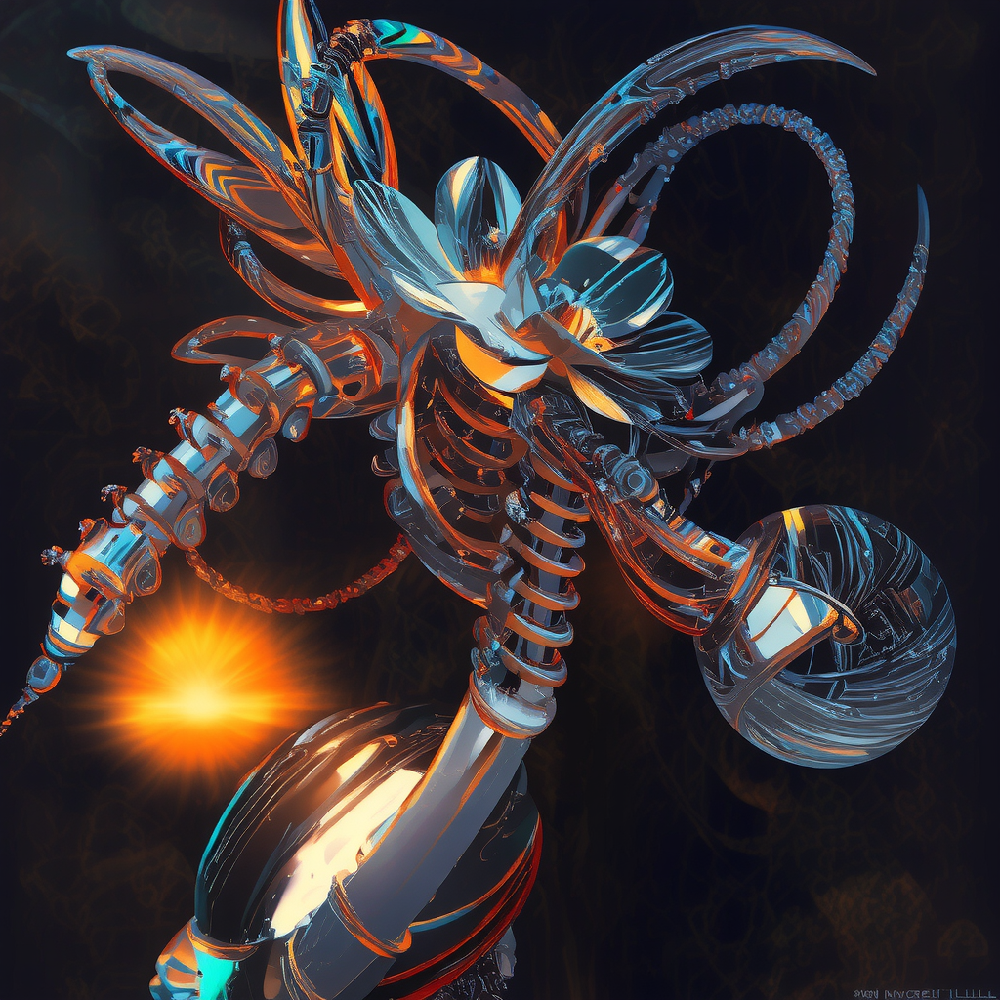
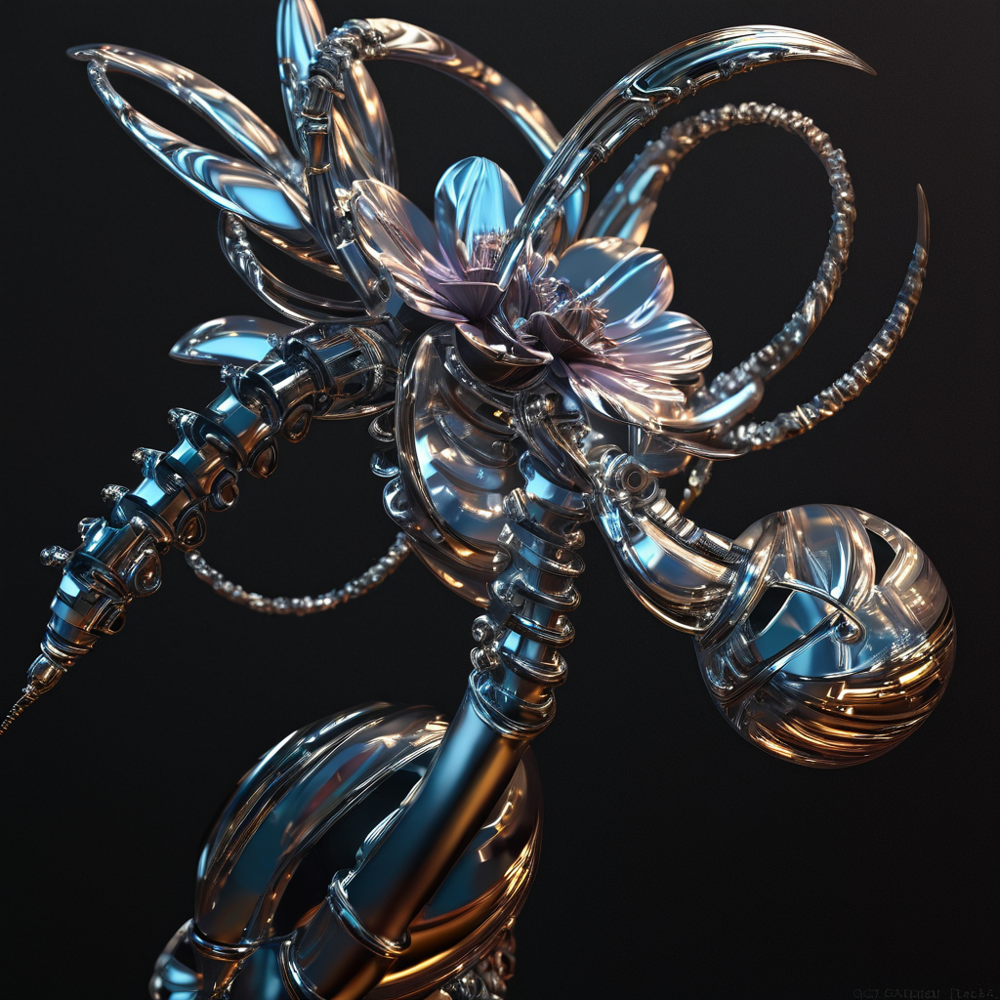
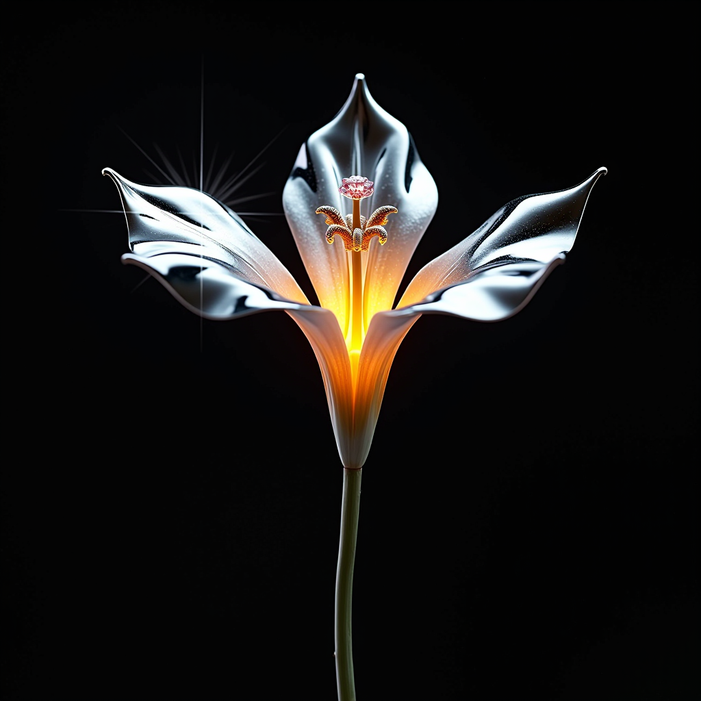
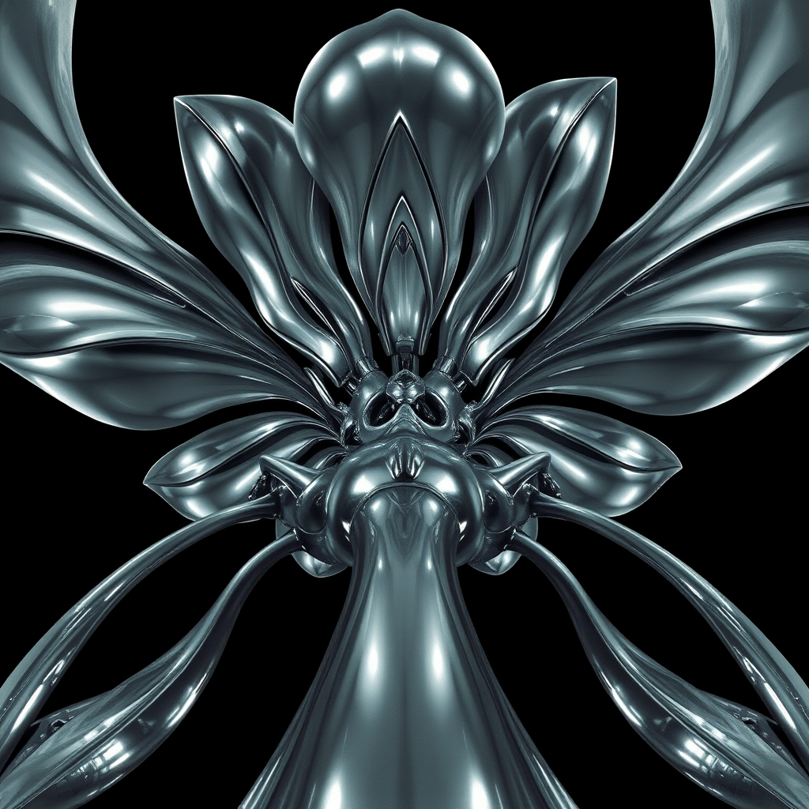
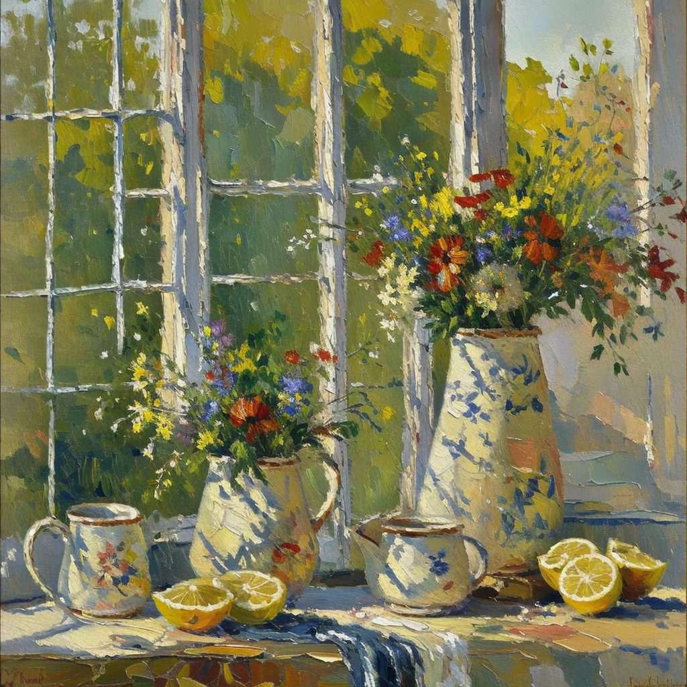
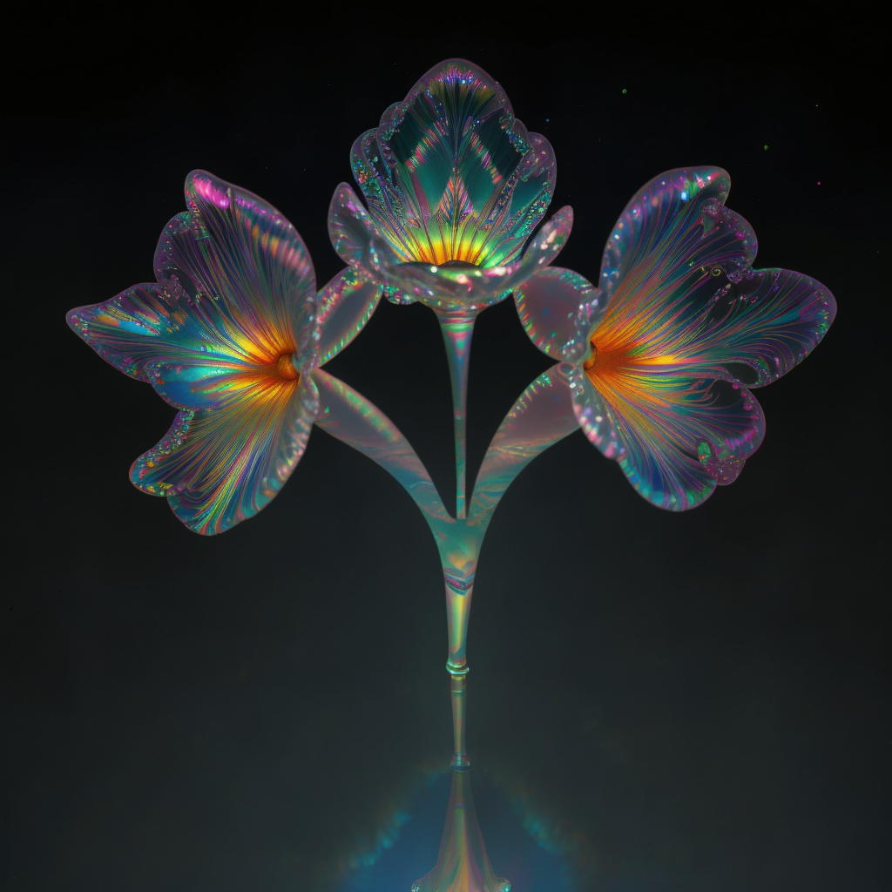
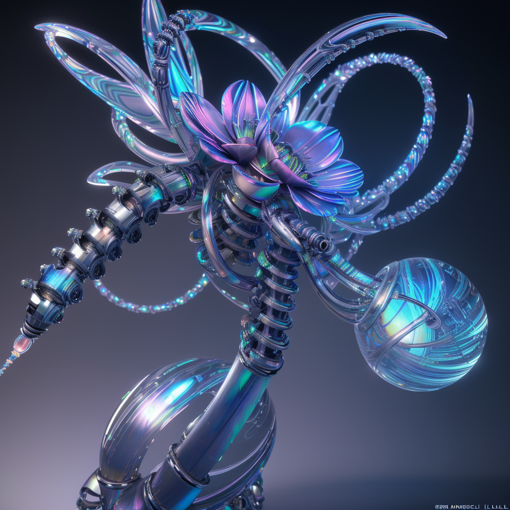
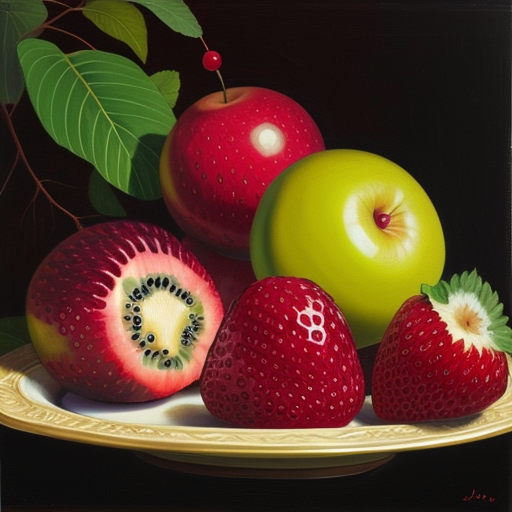

# Comfy Playgrounds

Learn how to use Comfy UI and generate images.

## 09 - Flux Controlnet
`Flux 1 schnell q8 gguf - Cloud T4 16Gb - 1024x1024 - 240s` 

## 08 - SDXL Controlnet
`Juggernaut XL V9 - Cloud T4 16Gb - 1024x1024 - 40s` 

## 07 - Metallic Flower
`Flux 1 Dev - Cloud T4 16Gb - 1024x1024 - 110s`

## 06 - Hajime Sorayama
`Flux 1 Schnell - Cloud T4 16Gb - 1024x1024 - 24s`

## 05 - Oilpainting Lora
`Juggernaut Reborn - M1 Max 32Gb - 1024x1024 - 114s`  

## 04 - Iridescent Flower
`Juggernaut Reborn - M1 Max 32Gb - 1024x1024 - 114s`  

## 03 - Glass Flowers
`Juggernaut Reborn - M1 Max 32Gb - 1024x1024 - 115s`  

## 02 - Image to Image  
`Juggernaut Reborn - M1 Max 32Gb - 512x512 - 12s`  

## 01 - Basic Image 
`Dreamshaper 8 - M1 Max 32Gb - 512x512 - 12s`  

